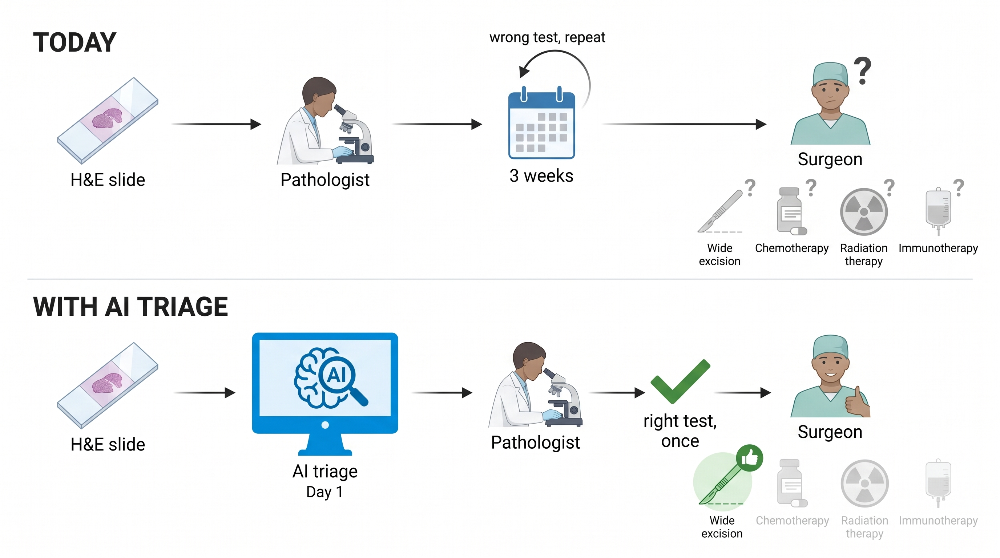
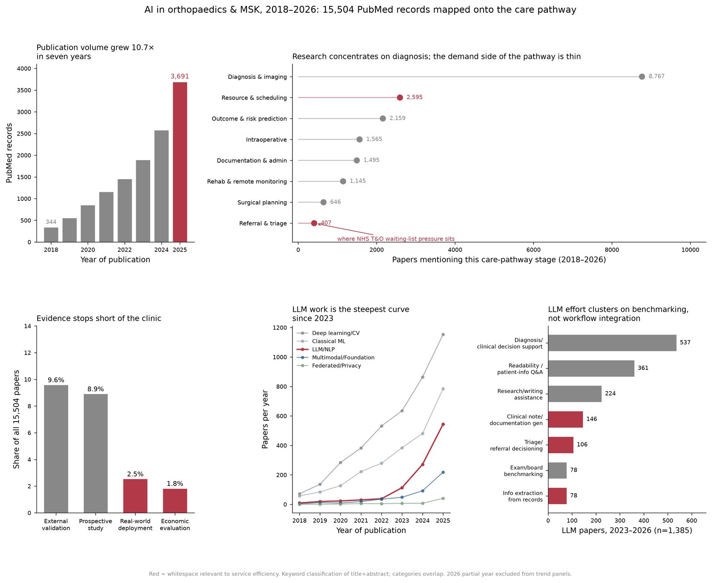
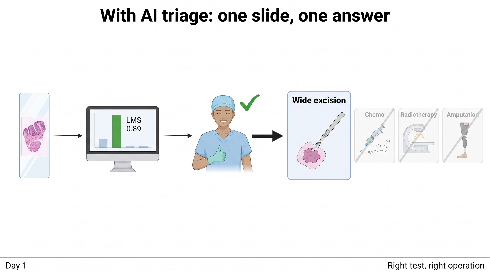

# Executive summary

**Problem.** Sarcoma is not one disease (Figure 4, in the Medical part). Its subtype decides the operation and the oncology plan, and many subtypes are defined by a gene fusion. The molecular test that names the fusion is slow and centralised: in England urgent solid tumour panels have a 21-day target ([East Genomics](https://www.eastgenomics.nhs.uk/about-us/quality/nhse-test-directory-turnaround-times/)), in Taiwan National Health Insurance reimburses next-generation sequencing once per lifetime and only at regional hospitals or above ([Health Promotion Administration](https://www.twhealth.org.tw/journalView.php?cat=70&sid=1190)). The most expensive failure comes earlier still: in 2,201 patients referred to the Royal Orthopaedic Hospital, Birmingham, 18 per cent had already had the lump removed elsewhere before anyone knew it was a sarcoma, and 87 per cent of those needed a second operation ([Chandrasekar and colleagues, J Bone Joint Surg Br 2008](https://doi.org/10.1302/0301-620X.90B2.19760)).

**Solution.** Figure 1 shows the pathway today and with AI triage. A model [(https://iressa-sarcoma-triage-demo.static.hf.space)](https://iressa-sarcoma-triage-demo.static.hf.space/) that reads the routine H&E slide already produced for every biopsy and returns, in minutes, a subtype probability and a recommendation for which genomic test to order first. It does not replace the test. It makes the first order the right one, so the orthopaedic oncology team has the subtype at its first multidisciplinary meeting and can settle limb salvage, margin and pre-operative chemotherapy three weeks earlier.

Across orthopaedic and musculoskeletal AI as a whole, referral and triage is the least studied stage of the care pathway (Figure 2), which is where this tool sits.

**Efficiency lever.** One H&E slide plus one model call replaces up to three weeks of waiting and one avoidable round of testing per misrouted case.

**Result so far.** Figure 3 shows what the surgeon gets. A reproducible baseline on open TCGA-SARC data separates two common subtypes from slide overviews with an out-of-fold AUC of 0.82 on 60 patients, and runs live in the browser at <https://iressa-sarcoma-triage-demo.static.hf.space/>.

**What is in this submission.**

| File | Content |
|---|---|
| `technical/01_sarcoma_hne_triage.ipynb` | Working baseline on open TCGA-SARC data, 60 patients, out-of-fold AUC 0.82 |
| `technical/technical_report.md` | Section-by-section write-up of how the baseline model was built, trained and evaluated (Technical part, sections 1 to 10) |
| `technical/02_savings_model.ipynb` | Transparent savings arithmetic, every input labelled sourced or assumption |
| `technical/03_robustness_checks.ipynb` | Bootstrap interval, repeated splits, permutation null, calibration, stain perturbation, tile maps |
| `technical/04_competitor_landscape.ipynb` | PubMed counts behind the competition figure, queries printed |
| `technical/05_more_data_checks.ipynb`, `06_second_round_checks.ipynb`, `07_fourth_class_and_resolution.ipynb` | Random cohort, third and fourth class, learning curve, other heads, attention pooling, pathology foundation model, stain normalisation, one level more resolution |
| `medicine/clinical_implementation.md` | Medical part: the clinical problem, where the AI sits, integration and safety, Taiwan, diversity, implementation stages |
| `business/business_case.md` | Business part on the NHS five-case model, strategic, economic, commercial, financial, management, which also carries the business plan: product, market, competition, sales, funding, projections, team and risks |
| `technical/requirements.txt`, `technical/fetch_overviews.py` | Environment and download helper |
| `group-member-contact/README.md` | Team and contributions |

