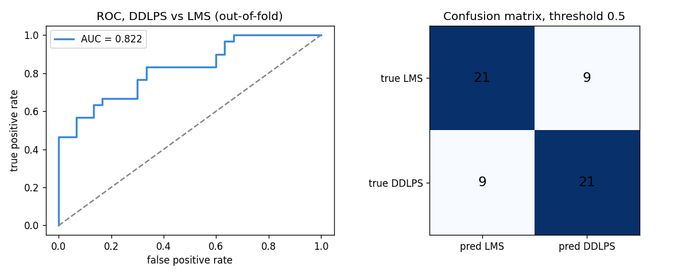
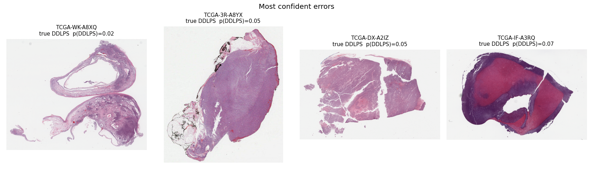
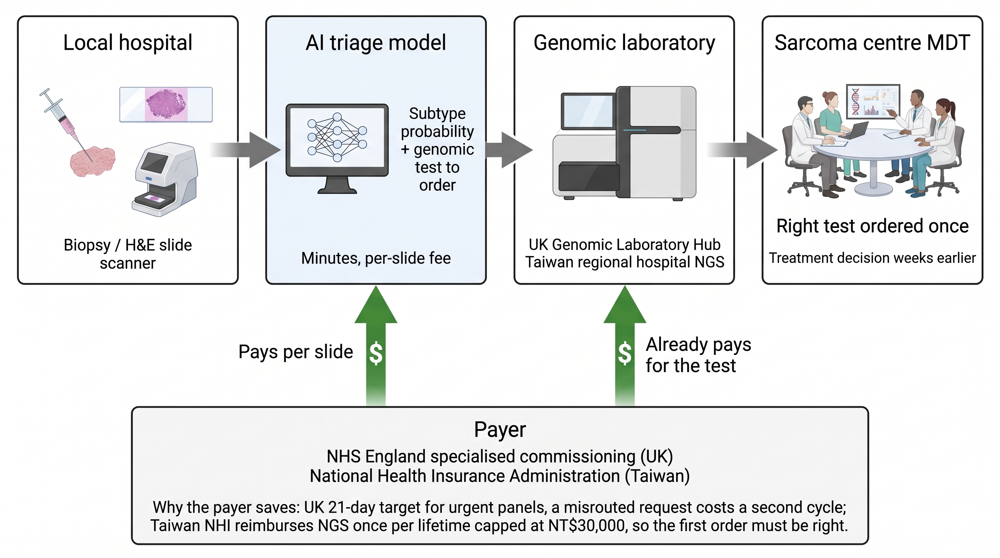

# 1. Summary


**Problem.** Sarcoma subtype decides the operation and the oncology plan, and many subtypes are defined by a gene fusion. The molecular test that names the fusion is slow and centralised: in England urgent solid tumour panels have a 21-day target ([East Genomics](https://www.eastgenomics.nhs.uk/about-us/quality/nhse-test-directory-turnaround-times/)), in Taiwan National Health Insurance reimburses next-generation sequencing once per lifetime and only at regional hospitals or above ([Health Promotion Administration](https://www.twhealth.org.tw/journalView.php?cat=70&sid=1190)).

**Solution.** A model that reads the routine H&E slide already produced for every biopsy and returns, in minutes, a subtype probability and a recommendation for which genomic test to order first. It does not replace the test. It makes the first order the right one.

**Efficiency lever.** One H&E slide plus one model call replaces up to three weeks of waiting and one avoidable round of testing per misrouted case.

**What is in this submission.**

| File | Content |
|---|---|
| `technical/01_sarcoma_hne_triage.ipynb` | Working baseline on open TCGA-SARC data, 60 patients, out-of-fold AUC 0.82 |
| `technical/technical_report.md` | Section-by-section write-up of how the baseline model was built, trained and evaluated (Technical report, sections 1 to 8) |
| `technical/02_savings_model.ipynb` | Transparent savings arithmetic, every input labelled sourced or assumption |
| `medicine/clinical_implementation.md` | Clinical background and four-stage implementation strategy |
| `business/business_case.md` | Payer, payment pathway, adoption, ethics and regulation, market, competition, unit economics, team, risks, milestones |
| `technical/requirements.txt`, `technical/fetch_overviews.py` | Environment and download helper |
| `group-member-contact/README.md` | Team and contributions |

# 2. Results of the baseline notebook


**Data.** All 600 TCGA-SARC diagnostic slides were listed through the public GDC API. Two subtypes were kept, leiomyosarcoma (LMS) and dedifferentiated liposarcoma (DDLPS), one slide per patient, 30 patients each. Only the lowest pyramid level of each slide was read over HTTP range requests, so the whole dataset is about 60 small images instead of 60 gigabytes ([GDC TCGA-SARC](https://portal.gdc.cancer.gov/projects/TCGA-SARC)).

**Method.** Each overview was tiled at 224 px, background removed, tiles passed through a frozen ImageNet ResNet50, features averaged per slide, and a logistic regression trained with 5-fold stratified cross-validation, seed 42, CPU only.

**Result.** Out-of-fold AUC **0.82**, per-fold 0.61 to 1.00, 42 of 60 patients correct at a 0.5 threshold (Figure 1).



**Where it fails.** The most confident errors are DDLPS slides dominated by fatty well-differentiated tissue or by large necrotic areas, which a mean over overview tiles cannot resolve. These cases define the next iteration: full-resolution tiles and attention pooling (Figure 2).



**Limitations, stated plainly.** Sixty patients, two subtypes, overview resolution only, a smallest-file selection bias, and a single scanning programme. The fusion-defined subtypes that are the clinical goal have too few open slides today. The production plan and the robustness gate are in the business case.

# 3. Payment pathway


Figure 3 shows who pays whom along the diagnostic pathway. Grey arrows carry the sample and the report, green arrows carry money.



# 4. How to run


```
conda create -n sarc python=3.12
pip install -r technical/requirements.txt
cd technical
jupyter lab 01_sarcoma_hne_triage.ipynb # run all, first run downloads ~60 overviews
jupyter lab 02_savings_model.ipynb
```

To see the trained baseline run on a slide, open the live demo at <https://iressa-sarcoma-triage-demo.static.hf.space/> (hosted as a Hugging Face Space; the model runs in your browser and the image never leaves your machine), or run it locally:

```
cd demo
python -m http.server 8765
```

Then open <http://localhost:8765/>, drop an H&E overview image or click one of the six bundled TCGA-SARC slides. The model runs in the browser in a few seconds and shows the subtype probabilities and the panel it would order first. `demo/README.md` explains the files.

Seed 42 is fixed in both notebooks. Features and overviews are cached under `technical/data/` after the first run.

# 5. Team and contributions


I-Han Cheng, team lead and sole member. Problem definition, data selection, model design, both notebooks, clinical implementation strategy, business case. Partners approached for the production phase, not authors of this submission: UCL sarcoma pathology group.

The clinical implementation strategy and the business case follow on the next pages.

